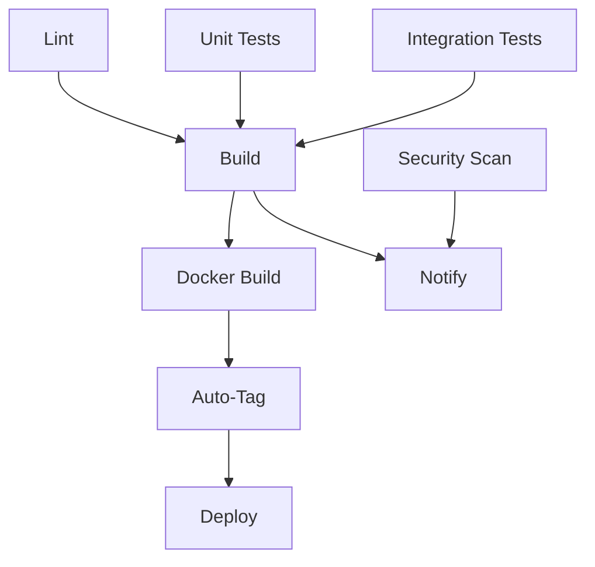
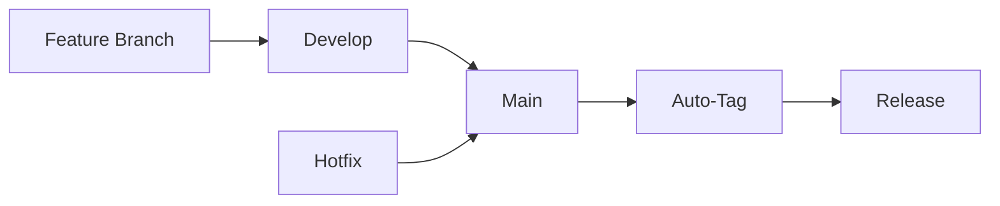

# CI/CD Pipeline Documentation

This document describes the comprehensive CI/CD pipeline for the Online Shop application, including automated testing, building, versioning, and deployment processes.

## 📋 Table of Contents

- [Overview](#overview)
- [Workflows](#workflows)
- [Auto-Versioning](#auto-versioning)
- [Branch Strategy](#branch-strategy)
- [Security](#security)
- [Deployment](#deployment)
- [Monitoring](#monitoring)
- [Troubleshooting](#troubleshooting)

## 🎯 Overview

The CI/CD pipeline is designed to ensure code quality, security, and reliable deployments through automated processes:

### Key Features
- **Automated Testing**: Unit, integration, and performance tests
- **Code Quality**: Linting, formatting, and security scanning
- **Auto-Versioning**: Semantic versioning based on commit messages
- **Multi-Platform Builds**: Linux, macOS, and Windows binaries
- **Docker Images**: Multi-architecture container images
- **Dependency Management**: Automated dependency updates
- **Security Scanning**: Vulnerability detection and SARIF reporting

### Pipeline Triggers
- **Push to main/develop**: Full CI/CD pipeline
- **Pull Requests**: Testing and validation
- **Manual Releases**: Custom version releases
- **Scheduled**: Maintenance and security scans

## 🔄 Workflows

### 1. Main CI/CD Pipeline (`.github/workflows/ci.yml`)

**Triggers**: Push to main/develop, Pull Requests

#### Jobs Overview


#### Job Details

##### 🔍 Lint and Format Check
- **Purpose**: Code quality validation
- **Tools**: golangci-lint, go fmt, go vet
- **Duration**: ~2 minutes
- **Artifacts**: Lint reports

```yaml
- name: Run golangci-lint
  run: golangci-lint run --timeout=5m
```

##### 🔒 Security Scan
- **Purpose**: Vulnerability detection
- **Tools**: Gosec, Trivy
- **Output**: SARIF reports uploaded to GitHub Security
- **Duration**: ~3 minutes

##### 🧪 Unit Tests
- **Purpose**: Component-level testing
- **Coverage**: 80%+ threshold
- **Features**: Race detection, coverage reporting
- **Duration**: ~5 minutes
- **Artifacts**: Coverage reports, test results

```yaml
- name: Run unit tests
  run: go test -v -race -coverprofile=coverage.out ./tests/unit/...
```

##### 🔗 Integration Tests
- **Purpose**: Service integration testing
- **Services**: PostgreSQL, Redis, RabbitMQ
- **Features**: Real service containers, health checks
- **Duration**: ~10 minutes

##### 🏗️ Build
- **Purpose**: Multi-platform binary compilation
- **Platforms**: Linux (amd64/arm64), macOS (amd64/arm64), Windows (amd64)
- **Features**: Version injection, build metadata
- **Duration**: ~8 minutes
- **Artifacts**: Platform-specific binaries

##### 🐳 Docker Build
- **Purpose**: Container image creation
- **Features**: Multi-architecture, layer caching
- **Registry**: GitHub Container Registry (ghcr.io)
- **Tags**: Branch-based, SHA-based, semantic versions

##### 🏷️ Auto-Tag
- **Purpose**: Automatic version tagging for main branch
- **Logic**: Semantic versioning based on commit messages
- **Features**: Release creation, changelog generation
- **Triggers**: Only on main branch pushes

### 2. Release Workflow (`.github/workflows/release.yml`)

**Triggers**: Manual workflow dispatch

#### Features
- **Custom Versioning**: Manual version specification
- **Release Types**: release, prerelease, hotfix
- **Validation**: Version format and uniqueness checks
- **Comprehensive Testing**: Full test suite before release
- **Asset Generation**: Binaries, checksums, Docker images
- **Release Notes**: Automated changelog and documentation

#### Usage
```bash
# Trigger via GitHub UI or CLI
gh workflow run release.yml \
  -f version=v1.2.3 \
  -f release_type=release \
  -f release_notes="Bug fixes and improvements"
```

### 3. Maintenance Workflow (`.github/workflows/maintenance.yml`)

**Triggers**: Daily schedule (2:00 AM UTC), Manual dispatch

#### Tasks
- **Security Scanning**: Daily vulnerability checks
- **Dependency Updates**: Outdated package detection
- **Performance Testing**: Benchmark execution
- **Repository Cleanup**: Old artifacts and workflow runs
- **Health Checks**: Repository health assessment

## 🏷️ Auto-Versioning

### Semantic Versioning Strategy

The pipeline automatically determines version bumps based on commit messages:

#### Version Bump Rules
- **Major** (`v1.0.0 → v2.0.0`): Breaking changes
- **Minor** (`v1.0.0 → v1.1.0`): New features
- **Patch** (`v1.0.0 → v1.0.1`): Bug fixes, documentation

#### Commit Message Patterns
```bash
# Major version bump
git commit -m "feat: new API with BREAKING CHANGE: removed old endpoint"
git commit -m "BREAKING CHANGE: restructured database schema"

# Minor version bump
git commit -m "feat: add user authentication"
git commit -m "feature: implement email notifications"

# Patch version bump
git commit -m "fix: resolve memory leak in worker pool"
git commit -m "docs: update API documentation"
git commit -m "refactor: improve error handling"
```

#### Auto-Tag Process
1. **Trigger**: Push to main branch
2. **Analysis**: Scan commits since last tag
3. **Calculation**: Determine version bump type
4. **Validation**: Ensure version doesn't exist
5. **Creation**: Create annotated Git tag
6. **Release**: Generate GitHub release with assets

### Manual Versioning

For custom releases or hotfixes:

```bash
# Using GitHub CLI
gh workflow run release.yml \
  -f version=v1.2.3-hotfix.1 \
  -f release_type=hotfix \
  -f release_notes="Critical security fix"

# Using GitHub UI
# Navigate to Actions → Release → Run workflow
```

## 🌿 Branch Strategy

### Branch Protection Rules

#### Main Branch
- **Protection**: Enabled
- **Requirements**:
  - Pull request reviews required (1+)
  - Status checks must pass
  - Branch must be up to date
  - Administrators included
- **Auto-merge**: Disabled
- **Delete head branches**: Enabled

#### Develop Branch
- **Protection**: Enabled
- **Requirements**:
  - Status checks must pass
  - Branch must be up to date
- **Auto-merge**: Enabled for dependabot
- **Delete head branches**: Enabled

### Workflow Integration



#### Branch Workflows
- **Feature branches** → **develop**: Full CI pipeline
- **develop** → **main**: Full CI/CD + auto-tagging
- **Hotfix branches** → **main**: Emergency releases
- **Release branches**: Manual release workflow

## 🔒 Security

### Security Scanning

#### Tools Integration
- **Gosec**: Go security analyzer
- **Trivy**: Vulnerability scanner
- **CodeQL**: Semantic code analysis
- **Dependabot**: Dependency vulnerability alerts

#### SARIF Integration
```yaml
- name: Upload SARIF file
  uses: github/codeql-action/upload-sarif@v2
  with:
    sarif_file: gosec.sarif
```

### Secrets Management

#### Required Secrets
- `GITHUB_TOKEN`: Automatic (GitHub provided)
- `DOCKER_REGISTRY_TOKEN`: Container registry access
- `DEPLOY_KEY`: Deployment credentials (if applicable)

#### Security Best Practices
- **Least Privilege**: Minimal required permissions
- **Secret Rotation**: Regular credential updates
- **Audit Logging**: All access logged
- **Environment Separation**: Different secrets per environment

### Dependency Security

#### Dependabot Configuration
```yaml
# .github/dependabot.yml
version: 2
updates:
  - package-ecosystem: "gomod"
    directory: "/"
    schedule:
      interval: "weekly"
    open-pull-requests-limit: 10
```

#### Security Policies
- **Automatic Updates**: Low-risk dependencies
- **Manual Review**: Major version updates
- **Security Patches**: Immediate application
- **License Compliance**: Automated license checking

## 🚀 Deployment

### Deployment Environments

#### Staging
- **Trigger**: Push to develop branch
- **Purpose**: Integration testing
- **Database**: Staging database
- **Features**: Full feature set, test data

#### Production
- **Trigger**: Push to main branch (after auto-tag)
- **Purpose**: Live application
- **Database**: Production database
- **Features**: Stable, monitored

### Deployment Strategies

#### Blue-Green Deployment
```yaml
deploy:
  strategy:
    type: blue-green
    health-check: /health
    timeout: 300s
```

#### Rolling Updates
```yaml
deploy:
  strategy:
    type: rolling
    max-unavailable: 25%
    max-surge: 25%
```

### Container Deployment

#### Docker Image Tags
- `latest`: Latest stable release
- `v1.2.3`: Specific version
- `main-abc123`: Branch and commit SHA
- `develop`: Latest development build

#### Kubernetes Deployment
```yaml
apiVersion: apps/v1
kind: Deployment
metadata:
  name: online-shop
spec:
  replicas: 3
  selector:
    matchLabels:
      app: online-shop
  template:
    spec:
      containers:
      - name: online-shop
        image: ghcr.io/kaffeInRacer/public-points:latest
        ports:
        - containerPort: 8080
```

## 📊 Monitoring

### Pipeline Monitoring

#### Metrics Tracked
- **Build Success Rate**: Percentage of successful builds
- **Test Coverage**: Code coverage percentage
- **Build Duration**: Time to complete pipeline
- **Deployment Frequency**: Releases per time period
- **Lead Time**: Commit to production time

#### Alerting
- **Failed Builds**: Immediate notification
- **Security Issues**: High-priority alerts
- **Performance Degradation**: Threshold-based alerts
- **Dependency Vulnerabilities**: Daily reports

### Application Monitoring

#### Health Checks
```go
func healthCheck(c *gin.Context) {
    status := map[string]interface{}{
        "status": "healthy",
        "version": version,
        "timestamp": time.Now().UTC(),
        "uptime": time.Since(startTime),
    }
    c.JSON(200, status)
}
```

#### Metrics Collection
- **Response Time**: API endpoint performance
- **Error Rate**: Application error percentage
- **Throughput**: Requests per second
- **Resource Usage**: CPU, memory, disk usage

## 🔧 Troubleshooting

### Common Issues

#### Build Failures

**Symptom**: Build job fails
```bash
# Check build logs
gh run view <run-id>

# Local reproduction
make build
```

**Solutions**:
- Check Go version compatibility
- Verify dependency versions
- Review build flags and environment

#### Test Failures

**Symptom**: Tests fail in CI but pass locally
```bash
# Run tests with same flags as CI
go test -v -race -timeout=30m ./tests/...

# Check for race conditions
go test -race ./...
```

**Solutions**:
- Ensure test isolation
- Check for timing dependencies
- Verify test data cleanup

#### Docker Build Issues

**Symptom**: Docker build fails or images are too large
```bash
# Local Docker build
docker build -t test .

# Check image size
docker images test
```

**Solutions**:
- Use multi-stage builds
- Optimize layer caching
- Remove unnecessary files

#### Auto-Tagging Issues

**Symptom**: Tags not created automatically
```bash
# Check commit messages
git log --oneline

# Verify branch protection rules
gh api repos/:owner/:repo/branches/main/protection
```

**Solutions**:
- Follow commit message conventions
- Ensure proper branch permissions
- Check workflow permissions

### Debug Commands

#### Workflow Debugging
```bash
# List workflow runs
gh run list

# View specific run
gh run view <run-id>

# Download artifacts
gh run download <run-id>

# Re-run failed jobs
gh run rerun <run-id>
```

#### Local Testing
```bash
# Run full test suite
make test

# Run specific test type
make test-unit
make test-integration

# Check coverage
make test-coverage

# Build all platforms
make build-all
```

### Performance Optimization

#### Pipeline Optimization
- **Parallel Jobs**: Run independent jobs concurrently
- **Caching**: Cache dependencies and build artifacts
- **Selective Testing**: Run only affected tests
- **Resource Allocation**: Optimize runner resources

#### Build Optimization
```yaml
# Use build cache
- name: Cache Go modules
  uses: actions/cache@v3
  with:
    path: |
      ~/.cache/go-build
      ~/go/pkg/mod
    key: ${{ runner.os }}-go-${{ hashFiles('**/go.sum') }}
```

## 📚 Additional Resources

### Documentation Links
- [GitHub Actions Documentation](https://docs.github.com/en/actions)
- [Docker Build Documentation](https://docs.docker.com/build/)
- [Go Testing Documentation](https://golang.org/pkg/testing/)
- [Semantic Versioning](https://semver.org/)

### Best Practices
- [CI/CD Best Practices](https://docs.github.com/en/actions/learn-github-actions/security-hardening-for-github-actions)
- [Container Security](https://docs.docker.com/develop/security-best-practices/)
- [Go Project Layout](https://github.com/golang-standards/project-layout)

---

This CI/CD pipeline ensures high-quality, secure, and reliable software delivery through automated processes and best practices. Regular monitoring and maintenance keep the pipeline efficient and effective.