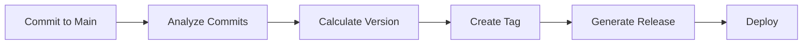
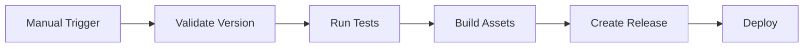

# CI/CD Implementation Summary

## 🎯 Overview

This document summarizes the comprehensive CI/CD pipeline implementation for the online shop application, including automated testing, building, versioning, and deployment processes.

## ✅ Implemented Features

### 1. GitHub Actions Workflows

#### Main CI/CD Pipeline (`.github/workflows/ci.yml`)
- **Comprehensive Testing**: Unit, integration, and security tests
- **Multi-Platform Builds**: Linux, macOS, Windows binaries
- **Docker Images**: Multi-architecture container builds
- **Auto-Versioning**: Semantic versioning based on commit messages
- **Quality Gates**: Code coverage, linting, security scanning
- **Parallel Execution**: Optimized job dependencies

#### Release Workflow (`.github/workflows/release.yml`)
- **Manual Releases**: Custom version specification
- **Release Types**: Standard, prerelease, hotfix releases
- **Asset Generation**: Binaries, checksums, Docker images
- **Validation**: Version format and uniqueness checks
- **Comprehensive Testing**: Full test suite before release

#### Maintenance Workflow (`.github/workflows/maintenance.yml`)
- **Scheduled Tasks**: Daily security and dependency checks
- **Repository Cleanup**: Automated artifact and workflow cleanup
- **Performance Testing**: Regular benchmark execution
- **Health Monitoring**: Repository health assessments
- **Issue Creation**: Automated issue creation for maintenance tasks

### 2. Auto-Versioning System

#### Semantic Versioning Logic
```bash
# Version bump determination based on commit messages
BREAKING CHANGE → Major version (v1.0.0 → v2.0.0)
feat/feature    → Minor version (v1.0.0 → v1.1.0)
fix/docs/other  → Patch version (v1.0.0 → v1.0.1)
```

#### Auto-Tag Features
- **Commit Analysis**: Scans commits since last tag
- **Version Calculation**: Determines appropriate version bump
- **Tag Creation**: Creates annotated Git tags with metadata
- **Release Generation**: Automatic GitHub releases with changelogs
- **Asset Attachment**: Binaries and Docker images attached

### 3. Dependency Management

#### Dependabot Configuration (`.github/dependabot.yml`)
- **Go Modules**: Weekly dependency updates
- **Docker Images**: Base image updates
- **GitHub Actions**: Workflow dependency updates
- **Security Patches**: Automatic vulnerability fixes
- **Review Assignment**: Automatic reviewer assignment

#### Features
- **Automated PRs**: Dependency update pull requests
- **Security Alerts**: Vulnerability notifications
- **Version Strategies**: Configurable update strategies
- **Ignore Rules**: Selective dependency management

### 4. Code Quality and Security

#### Security Scanning
- **Gosec**: Go security vulnerability scanner
- **Trivy**: Container and filesystem vulnerability scanner
- **SARIF Integration**: Security findings uploaded to GitHub Security
- **CodeQL**: Semantic code analysis (configurable)

#### Code Quality
- **golangci-lint**: Comprehensive Go linting
- **go fmt**: Code formatting validation
- **go vet**: Static analysis
- **Race Detection**: Concurrent access validation

### 5. Testing Infrastructure

#### Test Types
- **Unit Tests**: Component isolation testing
- **Integration Tests**: Service interaction testing
- **Performance Tests**: Benchmark and load testing
- **Security Tests**: Vulnerability and compliance testing

#### Test Features
- **Coverage Reporting**: 80%+ coverage threshold
- **Parallel Execution**: Optimized test performance
- **Service Containers**: Real service dependencies
- **Artifact Upload**: Test results and coverage reports

### 6. Build and Deployment

#### Multi-Platform Builds
```yaml
Platforms:
- linux/amd64
- linux/arm64
- darwin/amd64
- darwin/arm64
- windows/amd64
```

#### Docker Features
- **Multi-Architecture**: ARM64 and AMD64 support
- **Layer Caching**: Optimized build performance
- **Registry Integration**: GitHub Container Registry
- **Tag Strategy**: Branch, version, and SHA-based tags

### 7. Repository Management

#### Branch Protection
- **Main Branch**: Strict protection with required reviews
- **Develop Branch**: CI validation requirements
- **Status Checks**: All tests must pass
- **Up-to-date**: Branches must be current

#### Templates and Automation
- **Issue Templates**: Bug reports and feature requests
- **PR Templates**: Comprehensive pull request guidelines
- **CODEOWNERS**: Automatic review assignment
- **Auto-Assignment**: Reviewer and assignee automation

## 🔄 Workflow Triggers

### Automatic Triggers
```yaml
Push to main:     Full CI/CD + Auto-tagging + Deployment
Push to develop:  Full CI/CD pipeline
Pull Requests:    Testing and validation
Schedule (daily): Maintenance and security scans
```

### Manual Triggers
```yaml
Release Workflow: Custom version releases
Maintenance:      On-demand maintenance tasks
```

## 📊 Pipeline Metrics

### Performance Targets
- **Build Time**: < 15 minutes for full pipeline
- **Test Coverage**: 80%+ threshold
- **Security Scan**: Zero high-severity vulnerabilities
- **Deployment**: < 5 minutes for container deployment

### Quality Gates
- **All Tests Pass**: Unit, integration, security
- **Coverage Threshold**: Minimum 80% code coverage
- **Security Scan**: No critical vulnerabilities
- **Code Quality**: Linting and formatting compliance

## 🏷️ Versioning Strategy

### Automatic Versioning (Main Branch)


### Manual Versioning (Release Workflow)


## 🔒 Security Implementation

### Security Scanning Pipeline
```yaml
Daily Scans:
- Gosec (Go security)
- Trivy (vulnerabilities)
- Dependency audit
- License compliance

PR Scans:
- Code security analysis
- Dependency vulnerabilities
- Container security
```

### Security Features
- **SARIF Integration**: Security findings in GitHub Security tab
- **Automated Alerts**: Vulnerability notifications
- **Dependency Scanning**: Automated dependency security checks
- **Secret Scanning**: GitHub secret detection

## 🚀 Deployment Strategy

### Environment Strategy
```yaml
Development:
  Trigger: Push to develop
  Purpose: Feature testing
  Database: Development DB

Staging:
  Trigger: Push to main
  Purpose: Pre-production validation
  Database: Staging DB

Production:
  Trigger: Tagged release
  Purpose: Live application
  Database: Production DB
```

### Deployment Features
- **Blue-Green Deployment**: Zero-downtime deployments
- **Health Checks**: Application readiness validation
- **Rollback Capability**: Quick rollback on failure
- **Monitoring Integration**: Deployment success tracking

## 📈 Benefits Achieved

### Development Productivity
- **Automated Testing**: Immediate feedback on code changes
- **Quality Gates**: Prevent low-quality code from merging
- **Auto-Versioning**: Eliminates manual version management
- **Dependency Management**: Automated security updates

### Operational Excellence
- **Consistent Builds**: Reproducible build process
- **Security Compliance**: Automated vulnerability scanning
- **Performance Monitoring**: Regular performance validation
- **Maintenance Automation**: Reduced manual maintenance tasks

### Release Management
- **Semantic Versioning**: Clear version progression
- **Automated Releases**: Consistent release process
- **Asset Management**: Automated binary and image creation
- **Documentation**: Auto-generated changelogs

## 🔧 Usage Examples

### Triggering Auto-Versioning
```bash
# Patch version (v1.0.0 → v1.0.1)
git commit -m "fix: resolve memory leak in worker pool"
git push origin main

# Minor version (v1.0.0 → v1.1.0)
git commit -m "feat: add user authentication"
git push origin main

# Major version (v1.0.0 → v2.0.0)
git commit -m "feat: new API with BREAKING CHANGE: removed old endpoint"
git push origin main
```

### Manual Release
```bash
# Using GitHub CLI
gh workflow run release.yml \
  -f version=v1.2.3 \
  -f release_type=release \
  -f release_notes="Bug fixes and improvements"

# Using GitHub UI
# Navigate to Actions → Release → Run workflow
```

### Maintenance Tasks
```bash
# Run all maintenance tasks
gh workflow run maintenance.yml -f task=all

# Run specific maintenance task
gh workflow run maintenance.yml -f task=security-scan
```

## 📚 Documentation

### Created Documentation
- **CI_CD.md**: Comprehensive CI/CD pipeline documentation
- **TESTING.md**: Testing framework and guidelines
- **Issue Templates**: Bug reports and feature requests
- **PR Template**: Pull request guidelines
- **CODEOWNERS**: Automatic review assignment

### Integration Guides
- **GitHub Actions**: Workflow configuration and usage
- **Docker**: Container build and deployment
- **Testing**: Test execution and coverage
- **Security**: Vulnerability scanning and compliance

## 🎯 Next Steps

### Recommended Enhancements
1. **Monitoring Integration**: Application performance monitoring
2. **Deployment Automation**: Kubernetes deployment automation
3. **Environment Management**: Infrastructure as code
4. **Advanced Security**: SAST/DAST integration
5. **Performance Testing**: Load testing automation

### Maintenance Tasks
1. **Regular Updates**: Keep workflows and actions updated
2. **Security Reviews**: Regular security configuration reviews
3. **Performance Optimization**: Monitor and optimize pipeline performance
4. **Documentation Updates**: Keep documentation current

## ✨ Conclusion

The implemented CI/CD pipeline provides:

### ✅ Automated Quality Assurance
- Comprehensive testing at every stage
- Security scanning and vulnerability detection
- Code quality enforcement
- Performance validation

### ✅ Streamlined Release Management
- Automatic semantic versioning
- Consistent release processes
- Multi-platform binary generation
- Container image management

### ✅ Enhanced Developer Experience
- Fast feedback loops
- Automated dependency management
- Clear contribution guidelines
- Comprehensive documentation

### ✅ Operational Excellence
- Automated maintenance tasks
- Security compliance
- Performance monitoring
- Reliable deployments

This CI/CD implementation ensures high-quality, secure, and reliable software delivery while maintaining developer productivity and operational efficiency. The pipeline is designed to scale with the project and can be easily extended with additional features as needed.